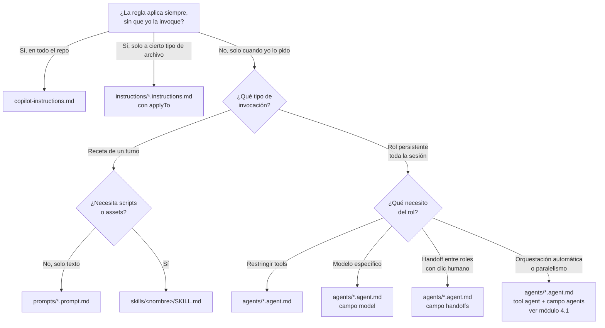

# Mapa de personalización de Copilot

Antes de entrar a los módulos prácticos, este documento responde una pregunta que confunde a casi todo el mundo la primera vez:

> ¿Qué tipo de archivo se carga solo y cuál tengo que invocar a mano?

Si tienes claridad sobre esto, el resto del workshop cae en su lugar.

## Las cuatro capas en una frase

| Capa | ¿Qué es? | ¿Dónde vive? |
|------|----------|--------------|
| **Instrucciones** | Reglas de estilo/contexto que Copilot debe respetar siempre | `.github/copilot-instructions.md` y `.github/instructions/*.instructions.md` |
| **Prompt files** | Recetas de un solo turno que invocas con `/` | `.github/prompts/*.prompt.md` |
| **Custom agents** | Roles con tools restringidas y modelo propio para toda una sesión | `.github/agents/*.agent.md` |
| **Subagents** | Un custom agent que invoca a otros como "tools" para orquestar flujos sin clics | `.github/agents/*.agent.md` con tool `agent` y campo `agents:` |
| **Agent skills** | Paquetes con `SKILL.md` + scripts/assets reutilizables | `.github/skills/<nombre>/SKILL.md` |

## ¿Cuál se carga automáticamente?

Esta es la parte que importa entender bien:

| Capa | ¿Se carga solo? | ¿Cuándo? |
|------|-----------------|----------|
| `copilot-instructions.md` | Sí, automático | En **cada** turno de chat, edit y agent. También en code review. |
| `instructions/*.instructions.md` con `applyTo` | Sí, automático | Solo cuando el archivo que estás editando o mencionando matchea el glob del `applyTo`. |
| Prompt files (`*.prompt.md`) | **No**, manual | Tú los invocas escribiendo `/nombre` en el chat. |
| Custom agents (`*.agent.md`) | **No**, manual | Los seleccionas en el dropdown de agente del chat. Quedan activos toda la sesión hasta que cambies. |
| Subagents | Automático **dentro** del agente coordinador | El coordinador decide cuándo invocarlos. Los workers con `user-invocable: false` no aparecen en el dropdown. |
| Agent skills (`SKILL.md`) | Mixto | El agente puede cargar una skill automáticamente si su descripción matchea la intención del usuario. También puedes invocarla con `/` o nombrándola. |

### Regla mental rápida

- **Automático** = reglas duras del repo (instrucciones).
- **Manual** = accesos directos a workflows (prompts, agentes, skills).

Si quieres que Copilot "siempre haga X", va en instrucciones.
Si quieres "cuando yo pida X, hazlo así", va en prompt file, agente o skill.

## ¿Cuál elegir?

> **Handoffs vs subagents**: ambos conectan custom agents entre sí, pero resuelven problemas distintos. Los **handoffs** muestran un botón al usuario entre pasos (humano en el loop, bueno para flujos donde quieres revisar resultados intermedios). Los **subagents** los invoca el coordinador sin clic intermedio y pueden correr en paralelo (bueno para orquestación autónoma y análisis multi-perspectiva). Se cubren a fondo en el [módulo 4.1](04_01-subagents.md).

## Diferencia concreta entre prompt file, agente y skill

Es común confundirlos. Un ejemplo con el mismo objetivo —revisar seguridad de un endpoint— muestra cuándo cada uno es la respuesta correcta:

| Necesidad | Solución correcta | Por qué |
|-----------|-------------------|---------|
| Texto fijo de 20 líneas que quiero reutilizar | **Prompt file** | No hay scripts, no hay rol. Solo una plantilla. |
| Quiero un revisor que nunca pueda editar código | **Custom agent** (revisor read-only) | Restringes tools (`read_file`, pero no `edit_file`). El dropdown lo deja activo toda la sesión. |
| Quiero un planificador que diseñe antes de tocar código | **Custom agent** (arquitecto) | Sin tools de edición ni ejecución. Fuerza a producir un plan en Markdown que luego otro agente implementa. Modelo fuerte (Opus) para razonamiento. |
| Quiero un ejecutor que solo aplique un plan ya aprobado | **Custom agent** (implementador) | Tools de `edit_file` y `runCommands` (para `dotnet build`), pero no puede cambiar arquitectura. Modelo más barato (Sonnet). |
| Quiero un revisor de dominio financiero con reglas de negocio | **Custom agent** (auditor-dominio) | System prompt con reglas específicas (uso de `decimal`, amortización francesa, rangos válidos). Solo lectura. Modelo Opus. |
| Quiero un agente de pruebas que escriba y ejecute tests xUnit | **Custom agent** (tester) | Tools de `edit_file` y `runCommands` limitados al proyecto `*.Tests`. System prompt con convenciones AAA y nombres en español. |
| Quiero un agente de migración de APIs legacy a Minimal API | **Custom agent** (migrador) | Rol muy específico que rara vez uso; perfecto para aislar en un agente que se activa manualmente solo cuando toca migrar. |
| Quiero un coordinador que orqueste arquitecto → implementador → auditor sin clics | **Custom agent** con subagents | Tool `agent` + campo `agents: [...]`. Ver [módulo 4.1](04_01-subagents.md). |
| Quiero empacar el revisor con un script que corre `dotnet format` y un checklist YAML | **Skill** | Tiene recursos externos (script, checklist) que viajan junto al `SKILL.md`. |

Regla: **el prompt file es texto, la skill es texto + archivos, el agente es identidad**.

Cuándo un rol merece su propio agente (y no ser solo un prompt file):

- Necesitas **restringir tools** para garantías estructurales (un revisor que físicamente no puede editar).
- Quieres usar un **modelo distinto** al por defecto (Opus para razonar, Sonnet para ejecutar, modelo barato para clasificar).
- El rol es **persistente**: lo activas y haces varias interacciones bajo esa identidad sin tener que re-invocar una receta cada turno.
- Participa en **handoffs** o **subagents** con otros agentes.

Si ninguna de esas cuatro aplica, probablemente lo que necesitas es un prompt file.

## Subagents: un agente que invoca a otros

Un **subagent** no es una quinta capa; es un patrón de uso de los custom agents. Un agente "coordinador" recibe en sus tools la tool `agent` y un campo `agents: [...]` con los workers que puede invocar. Cuando el coordinador detecta una tarea que encaja con un worker, lo llama como si fuera una función, espera el resultado y sigue trabajando.

Tres diferencias importantes contra los **handoffs**:

| | Handoffs | Subagents |
|---|----------|-----------|
| Disparo | El usuario hace clic en un botón | El coordinador decide, sin clic |
| Contexto | Se transfiere al siguiente agente | Cada subagent tiene context window aislado |
| Paralelismo | No | Sí, varios workers al mismo tiempo |
| Cuándo usar | Humano en el loop entre pasos | Orquestación autónoma o revisión multi-perspectiva |

Los workers suelen marcarse con `user-invocable: false` en el frontmatter para que **no aparezcan en el dropdown** del usuario; solo existen como piezas internas del coordinador.

Detalle completo, patrones secuencial/paralelo y ejemplos en [módulo 4.1](04_01-subagents.md).

## Orden en que Copilot compone el contexto

Cuando escribes en el chat, Copilot arma el prompt efectivo más o menos así:

1. **System prompt** de la extensión (no lo controlas).
2. **`copilot-instructions.md`** completo.
3. **`instructions/*.instructions.md`** cuyos `applyTo` matchean los archivos en contexto.
4. **Custom agent activo** (si seleccionaste uno): su system prompt, tools permitidas, modelo.
5. **Skill invocada** (si aplica): contenido del `SKILL.md` y referencias a sus assets.
6. **Prompt file expandido** (si usaste `/`): su contenido se inserta como si lo hubieras escrito tú.
7. Tu mensaje actual.
8. Archivos que adjuntaste o abiertos relevantes.

Entender ese orden explica por qué:

- Las instrucciones ganan cuando hay contradicción con un prompt file: llegan antes en el contexto.
- Un agente con tools restringidas no se "salta" las instrucciones del repo: se suman.
- Meter demasiado en `copilot-instructions.md` sale caro: ese contenido viaja en **todos** los turnos.

## Límites que importan

| Capa | Límite práctico |
|------|-----------------|
| `copilot-instructions.md` | 4000 caracteres efectivos para code review. Más allá, se trunca. |
| Instrucciones path-specific | Sin límite duro, pero cada archivo que matchea suma contexto. |
| Prompt files | Sin límite duro, pero si pasa de ~200 líneas estás haciendo otra cosa (probablemente una skill). |
| Custom agents | El system prompt del agente reemplaza parte del system prompt genérico. |
| Skills | Los assets referenciados solo se cargan si el agente decide leerlos. |

## Qué leer después

- Si apenas empiezas: [Módulo 1: Setup](01-setup.md).
- Si ya viste agentes y quieres orquestación automática: [Módulo 4.1: Subagents](04_01-subagents.md).
- Si quieres el árbol de decisión con anti-patrones: [Módulo 7: Cuándo usar qué](07-cuando-usar-que.md).
- Si te confunde algún término concreto: [Glosario](glosario.md).
